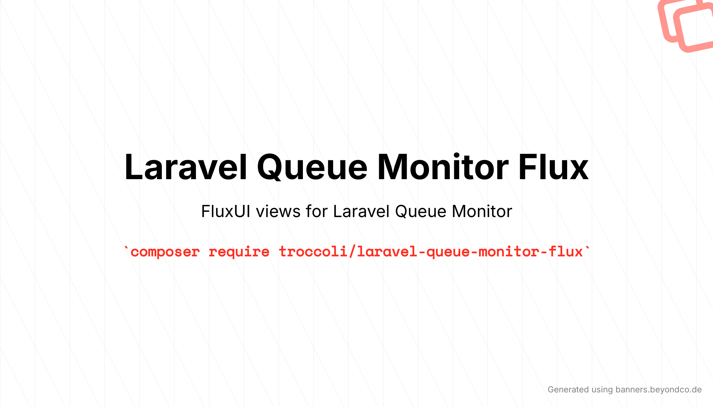

# Laravel Queue Monitor Flux

[](https://packagist.org/packages/troccoli/laravel-queue-monitor-flux)
[](https://packagist.org/packages/troccoli/laravel-queue-monitor-flux)
[](https://packagist.org/packages/troccoli/laravel-queue-monitor-flux)

Laravel Queue Monitor Flux replaces the default views from [`romanzipp/laravel-queue-monitor`](https://github.com/romanzipp/Laravel-Queue-Monitor) with templates built using [Flux UI](https://fluxui.dev/). The package registers its view overrides automatically when installed; publish the templates if you want to customize them in your application.

## Requirements

- PHP 8.5 or later
- Laravel 13
- [`romanzipp/laravel-queue-monitor`](https://github.com/romanzipp/Laravel-Queue-Monitor) 5.4 or later
- [`livewire/flux`](https://fluxui.dev/) 2.x

Composer installs the Queue Monitor and Flux dependencies alongside this package.

## Installation

Install the package with Composer:

```bash
composer require troccoli/laravel-queue-monitor-flux
```

Laravel discovers the service provider automatically. The Flux templates are then used in place of Queue Monitor's default views.

## Publish and customize the views

To publish the Blade templates into your application, run:

```bash
php artisan vendor:publish --provider="Troccoli\LaravelQueueMonitorFlux\QueueMonitorFluxServiceProvider" --tag=views
```

The templates are published to `resources/views/vendor/queue-monitor-flux`. You can edit those files to tailor the interface to your application. Published templates take precedence over the package's built-in templates.

## Configure Laravel Queue Monitor

This package only supplies the Flux UI views. Configure queues, storage, pruning, authorization, and the rest of Laravel Queue Monitor using the [Laravel Queue Monitor documentation](https://github.com/romanzipp/Laravel-Queue-Monitor#documentation).

## License

Laravel Queue Monitor Flux is open-sourced software licensed under the [MIT license](LICENSE.md).
